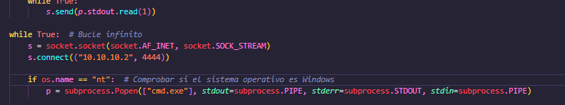
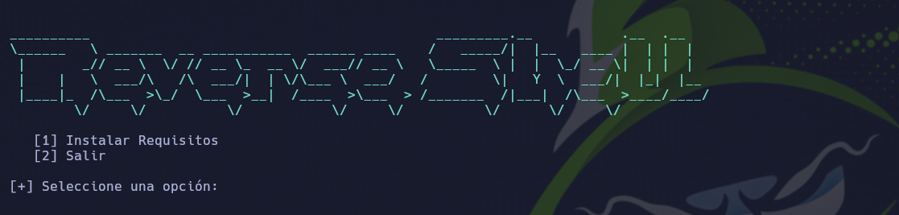
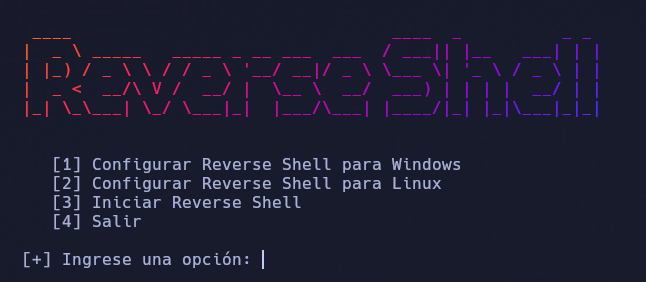

# Reverse Shell

<p align="center">

</p>

Una reverse shell (o "shell inversa") es una técnica utilizada en ciberseguridad y piratería informática que implica establecer una conexión entre un atacante y una máquina objetivo, permitiendo al atacante ejecutar comandos en la máquina remota de forma remota. Esta técnica es comúnmente utilizada por los hackers para obtener acceso no autorizado a sistemas informáticos y tomar el control de ellos.

### Configuración

Para configuirar la reverse shell para windows debes configurar la IP del atacante en el archivo **shell.py** al igual que debes configurar la IP para linux en el archivo **shell.sh**:

<p align="center">

</p>

Luego de esto puedes ejecutar el script.

```
git clone https://github.com/bl4ck44/reverse-shell.git

cd reverse-shell

sudo chmod +x setup.sh

bash setup.sh

python3 config.py
```

<p align="center">

</p>

<p align="center">

</p>